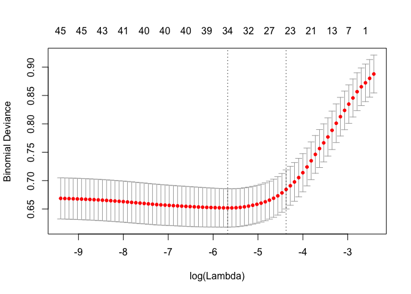

## Introduction


```r
# load raw data
employeeDatRaw <- read.csv('CaseStudy2data.csv', header=TRUE)
```

# Missing Values

Fortunately, this data is not missing any values as demonstrated by the table below.


```r
# calculate NAs for raw data
NAdataframe <- sapply(employeeDatRaw, function(x) sum(is.na(x)))
# display NAs in kable table
knitr::kable(NAdataframe, caption = "Counts of NAs (Missing Values) in Raw Data", row.names = TRUE, "html") %>%
  kable_styling(bootstrap_options = c("striped","hover","condensed"), full_width=FALSE, position = "left")
```

<table class="table table-striped table-hover table-condensed" style="width: auto !important; ">
<caption>Counts of NAs (Missing Values) in Raw Data</caption>
<tbody>
  <tr>
   <td style="text-align:left;"> Age </td>
   <td style="text-align:right;"> 0 </td>
  </tr>
  <tr>
   <td style="text-align:left;"> Attrition </td>
   <td style="text-align:right;"> 0 </td>
  </tr>
  <tr>
   <td style="text-align:left;"> BusinessTravel </td>
   <td style="text-align:right;"> 0 </td>
  </tr>
  <tr>
   <td style="text-align:left;"> DailyRate </td>
   <td style="text-align:right;"> 0 </td>
  </tr>
  <tr>
   <td style="text-align:left;"> Department </td>
   <td style="text-align:right;"> 0 </td>
  </tr>
  <tr>
   <td style="text-align:left;"> DistanceFromHome </td>
   <td style="text-align:right;"> 0 </td>
  </tr>
  <tr>
   <td style="text-align:left;"> Education </td>
   <td style="text-align:right;"> 0 </td>
  </tr>
  <tr>
   <td style="text-align:left;"> EducationField </td>
   <td style="text-align:right;"> 0 </td>
  </tr>
  <tr>
   <td style="text-align:left;"> EmployeeCount </td>
   <td style="text-align:right;"> 0 </td>
  </tr>
  <tr>
   <td style="text-align:left;"> EmployeeNumber </td>
   <td style="text-align:right;"> 0 </td>
  </tr>
  <tr>
   <td style="text-align:left;"> EnvironmentSatisfaction </td>
   <td style="text-align:right;"> 0 </td>
  </tr>
  <tr>
   <td style="text-align:left;"> Gender </td>
   <td style="text-align:right;"> 0 </td>
  </tr>
  <tr>
   <td style="text-align:left;"> HourlyRate </td>
   <td style="text-align:right;"> 0 </td>
  </tr>
  <tr>
   <td style="text-align:left;"> JobInvolvement </td>
   <td style="text-align:right;"> 0 </td>
  </tr>
  <tr>
   <td style="text-align:left;"> JobLevel </td>
   <td style="text-align:right;"> 0 </td>
  </tr>
  <tr>
   <td style="text-align:left;"> JobRole </td>
   <td style="text-align:right;"> 0 </td>
  </tr>
  <tr>
   <td style="text-align:left;"> JobSatisfaction </td>
   <td style="text-align:right;"> 0 </td>
  </tr>
  <tr>
   <td style="text-align:left;"> MaritalStatus </td>
   <td style="text-align:right;"> 0 </td>
  </tr>
  <tr>
   <td style="text-align:left;"> MonthlyIncome </td>
   <td style="text-align:right;"> 0 </td>
  </tr>
  <tr>
   <td style="text-align:left;"> MonthlyRate </td>
   <td style="text-align:right;"> 0 </td>
  </tr>
  <tr>
   <td style="text-align:left;"> NumCompaniesWorked </td>
   <td style="text-align:right;"> 0 </td>
  </tr>
  <tr>
   <td style="text-align:left;"> Over18 </td>
   <td style="text-align:right;"> 0 </td>
  </tr>
  <tr>
   <td style="text-align:left;"> OverTime </td>
   <td style="text-align:right;"> 0 </td>
  </tr>
  <tr>
   <td style="text-align:left;"> PercentSalaryHike </td>
   <td style="text-align:right;"> 0 </td>
  </tr>
  <tr>
   <td style="text-align:left;"> PerformanceRating </td>
   <td style="text-align:right;"> 0 </td>
  </tr>
  <tr>
   <td style="text-align:left;"> RelationshipSatisfaction </td>
   <td style="text-align:right;"> 0 </td>
  </tr>
  <tr>
   <td style="text-align:left;"> StandardHours </td>
   <td style="text-align:right;"> 0 </td>
  </tr>
  <tr>
   <td style="text-align:left;"> StockOptionLevel </td>
   <td style="text-align:right;"> 0 </td>
  </tr>
  <tr>
   <td style="text-align:left;"> TotalWorkingYears </td>
   <td style="text-align:right;"> 0 </td>
  </tr>
  <tr>
   <td style="text-align:left;"> TrainingTimesLastYear </td>
   <td style="text-align:right;"> 0 </td>
  </tr>
  <tr>
   <td style="text-align:left;"> WorkLifeBalance </td>
   <td style="text-align:right;"> 0 </td>
  </tr>
  <tr>
   <td style="text-align:left;"> YearsAtCompany </td>
   <td style="text-align:right;"> 0 </td>
  </tr>
  <tr>
   <td style="text-align:left;"> YearsInCurrentRole </td>
   <td style="text-align:right;"> 0 </td>
  </tr>
  <tr>
   <td style="text-align:left;"> YearsSinceLastPromotion </td>
   <td style="text-align:right;"> 0 </td>
  </tr>
  <tr>
   <td style="text-align:left;"> YearsWithCurrManager </td>
   <td style="text-align:right;"> 0 </td>
  </tr>
</tbody>
</table>

## Data Cleanup and Conversion

#### Checking for missing data values . . .


```r
# check for missing data values
numNAs <- sum(apply(employeeDatRaw,2,is.na))
```

##### Number of missing data values = 0

#### Columns with no variation have no impact on attrition. Dropping . . .


```r
# look for and drop columns with no variation
drop_columns <- which(apply(employeeDatRaw, 2, function(x) (length(unique(x)) == 1)))
cols <- names(drop_columns)
employeeDatRaw <- employeeDatRaw[,-drop_columns]

# find columns of class factor
factor_columns <- names(which(sapply(names(employeeDatRaw),function(x) class(employeeDatRaw[[x]])=="factor")))

# convert factors to numeric
#employeeDatRaw[,factor_columns] <- sapply(factor_columns,function(x) as.numeric(employeeDatRaw[[x]])-1)
employeeDatRaw$Attrition <- as.numeric(employeeDatRaw$Attrition)-1
```

##### Dropped columns: EmployeeCount, Over18, StandardHours
##### Factors converted to numeric: Attrition, BusinessTravel, Department, EducationField, Gender, JobRole, MaritalStatus, OverTime

## Attrition Rates (Competitor Analysis)


```r
# determine overall attrition rate
attritionRate <- (sum(employeeDatRaw$Attrition) / nrow(employeeDatRaw)) * 100

ind <- c("Overall","Healthcare","Manufacturing")
vol <- c(13.5, 15.9, 11.1)
invol <- c(18.5, 20.5, 17.0)
industryRates <- data.frame(ind,vol,invol)
names(industryRates) <- c("Industry", "Voluntary(%)", "Involuntary(%)")

# display industry attrition
knitr::kable(industryRates, caption = "Attrition Rates. Per Compdata Surveys & Consulting's Turnover Report 2017", row.names = FALSE, "html") %>%
  kable_styling(bootstrap_options = c("striped","hover", "condensed", "responsive"))
```

<table class="table table-striped table-hover table-condensed table-responsive" style="margin-left: auto; margin-right: auto;">
<caption>Attrition Rates. Per Compdata Surveys &amp; Consulting's Turnover Report 2017</caption>
 <thead>
  <tr>
   <th style="text-align:left;"> Industry </th>
   <th style="text-align:right;"> Voluntary(%) </th>
   <th style="text-align:right;"> Involuntary(%) </th>
  </tr>
 </thead>
<tbody>
  <tr>
   <td style="text-align:left;"> Overall </td>
   <td style="text-align:right;"> 14 </td>
   <td style="text-align:right;"> 18 </td>
  </tr>
  <tr>
   <td style="text-align:left;"> Healthcare </td>
   <td style="text-align:right;"> 16 </td>
   <td style="text-align:right;"> 20 </td>
  </tr>
  <tr>
   <td style="text-align:left;"> Manufacturing </td>
   <td style="text-align:right;"> 11 </td>
   <td style="text-align:right;"> 17 </td>
  </tr>
</tbody>
</table>
##### reference: http://blog.compdatasurveys.com/employee-turnover-trends-in-2017

## Attrition Rates (XYZ Company)

##### Overall attrition rate: 16.12%


```r
# determine attrition rate by department
AttritionByDept <- aggregate(employeeDatRaw$Attrition,by=list(Department=employeeDatRaw$Department),FUN=sum)
SizeByDept <- count(employeeDatRaw,"Department")
attritionRateByDept <- merge(AttritionByDept, SizeByDept, by="Department")
attritionRateByDept$Rate <- (attritionRateByDept$x / attritionRateByDept$freq) * 100
names(attritionRateByDept) <- c("Department", "Attrition", "PopulationSize", "AttritionRate")

# display attrition by department
knitr::kable(attritionRateByDept,caption = "Attrition Rates by Department", row.names = FALSE, "html") %>%
  kable_styling(bootstrap_options = c("striped","hover", "condensed", "responsive"))
```

<table class="table table-striped table-hover table-condensed table-responsive" style="margin-left: auto; margin-right: auto;">
<caption>Attrition Rates by Department</caption>
 <thead>
  <tr>
   <th style="text-align:left;"> Department </th>
   <th style="text-align:right;"> Attrition </th>
   <th style="text-align:right;"> PopulationSize </th>
   <th style="text-align:right;"> AttritionRate </th>
  </tr>
 </thead>
<tbody>
  <tr>
   <td style="text-align:left;"> Human Resources </td>
   <td style="text-align:right;"> 12 </td>
   <td style="text-align:right;"> 63 </td>
   <td style="text-align:right;"> 19 </td>
  </tr>
  <tr>
   <td style="text-align:left;"> Research &amp; Development </td>
   <td style="text-align:right;"> 133 </td>
   <td style="text-align:right;"> 961 </td>
   <td style="text-align:right;"> 14 </td>
  </tr>
  <tr>
   <td style="text-align:left;"> Sales </td>
   <td style="text-align:right;"> 92 </td>
   <td style="text-align:right;"> 446 </td>
   <td style="text-align:right;"> 21 </td>
  </tr>
</tbody>
</table>

```r
# determine attrition rate by job role
attritionByJobRole <- aggregate(employeeDatRaw$Attrition, by=list(JobRole=employeeDatRaw$JobRole), FUN=sum)
sizeByRole <- count(employeeDatRaw,"JobRole")
attritionRateByJobRole <- merge(attritionByJobRole,sizeByRole, by="JobRole")
attritionRateByJobRole$Rate <- (attritionRateByJobRole$x / attritionRateByJobRole$freq) * 100
names(attritionRateByJobRole) <- c("JobRole", "Attrition", "PopulationSize", "AttritionRate")

# display attrition rate by job role
knitr::kable(attritionRateByJobRole,caption = "Attrition Rates by Job Role", row.names = FALSE, "html") %>%
  kable_styling(bootstrap_options = c("striped","hover", "condensed", "responsive"))
```

<table class="table table-striped table-hover table-condensed table-responsive" style="margin-left: auto; margin-right: auto;">
<caption>Attrition Rates by Job Role</caption>
 <thead>
  <tr>
   <th style="text-align:left;"> JobRole </th>
   <th style="text-align:right;"> Attrition </th>
   <th style="text-align:right;"> PopulationSize </th>
   <th style="text-align:right;"> AttritionRate </th>
  </tr>
 </thead>
<tbody>
  <tr>
   <td style="text-align:left;"> Healthcare Representative </td>
   <td style="text-align:right;"> 9 </td>
   <td style="text-align:right;"> 131 </td>
   <td style="text-align:right;"> 6.9 </td>
  </tr>
  <tr>
   <td style="text-align:left;"> Human Resources </td>
   <td style="text-align:right;"> 12 </td>
   <td style="text-align:right;"> 52 </td>
   <td style="text-align:right;"> 23.1 </td>
  </tr>
  <tr>
   <td style="text-align:left;"> Laboratory Technician </td>
   <td style="text-align:right;"> 62 </td>
   <td style="text-align:right;"> 259 </td>
   <td style="text-align:right;"> 23.9 </td>
  </tr>
  <tr>
   <td style="text-align:left;"> Manager </td>
   <td style="text-align:right;"> 5 </td>
   <td style="text-align:right;"> 102 </td>
   <td style="text-align:right;"> 4.9 </td>
  </tr>
  <tr>
   <td style="text-align:left;"> Manufacturing Director </td>
   <td style="text-align:right;"> 10 </td>
   <td style="text-align:right;"> 145 </td>
   <td style="text-align:right;"> 6.9 </td>
  </tr>
  <tr>
   <td style="text-align:left;"> Research Director </td>
   <td style="text-align:right;"> 2 </td>
   <td style="text-align:right;"> 80 </td>
   <td style="text-align:right;"> 2.5 </td>
  </tr>
  <tr>
   <td style="text-align:left;"> Research Scientist </td>
   <td style="text-align:right;"> 47 </td>
   <td style="text-align:right;"> 292 </td>
   <td style="text-align:right;"> 16.1 </td>
  </tr>
  <tr>
   <td style="text-align:left;"> Sales Executive </td>
   <td style="text-align:right;"> 57 </td>
   <td style="text-align:right;"> 326 </td>
   <td style="text-align:right;"> 17.5 </td>
  </tr>
  <tr>
   <td style="text-align:left;"> Sales Representative </td>
   <td style="text-align:right;"> 33 </td>
   <td style="text-align:right;"> 83 </td>
   <td style="text-align:right;"> 39.8 </td>
  </tr>
</tbody>
</table>

```r
# determine attrition rate by gender
attritionByGender <- aggregate(employeeDatRaw$Attrition, by=list(Gender=employeeDatRaw$Gender), FUN=sum)
sizeByGender <- count(employeeDatRaw,"Gender")
attritionRateByGender <- merge(attritionByGender,sizeByGender, by="Gender")
attritionRateByGender$Rate <- (attritionRateByGender$x / attritionRateByGender$freq) * 100
names(attritionRateByGender) <- c("Gender", "Attrition", "PopulationSize", "AttritionRate")

# display attrition rate by gender
knitr::kable(attritionRateByGender,caption = "Attrition Rates by Gender", row.names = FALSE, "html") %>%
  kable_styling(bootstrap_options = c("striped","hover", "condensed", "responsive"))
```

<table class="table table-striped table-hover table-condensed table-responsive" style="margin-left: auto; margin-right: auto;">
<caption>Attrition Rates by Gender</caption>
 <thead>
  <tr>
   <th style="text-align:left;"> Gender </th>
   <th style="text-align:right;"> Attrition </th>
   <th style="text-align:right;"> PopulationSize </th>
   <th style="text-align:right;"> AttritionRate </th>
  </tr>
 </thead>
<tbody>
  <tr>
   <td style="text-align:left;"> Female </td>
   <td style="text-align:right;"> 87 </td>
   <td style="text-align:right;"> 588 </td>
   <td style="text-align:right;"> 15 </td>
  </tr>
  <tr>
   <td style="text-align:left;"> Male </td>
   <td style="text-align:right;"> 150 </td>
   <td style="text-align:right;"> 882 </td>
   <td style="text-align:right;"> 17 </td>
  </tr>
</tbody>
</table>

```r
ageBin <- function(x) {
  if (x < 25) return ("< 25")
  if (x < 35) return ("25-35")
  if (x < 45) return ("35-45")
  if (x < 55) return ("45-55")
  return("55 and >")
}
# determine attrition rate by age
attritionRaw <- employeeDatRaw
attritionRaw$AgeBin <- sapply(attritionRaw$Age, ageBin)
attritionByAge <- aggregate(attritionRaw$Attrition, by=list(AgeBin=attritionRaw$AgeBin), FUN=sum)
sizeByAge <- count(attritionRaw,"AgeBin")
attritionRateByAge <- merge(attritionByAge, sizeByAge, by="AgeBin")
attritionRateByAge$Rate <- (attritionRateByAge$x / attritionRateByAge$freq) * 100
names(attritionRateByAge) <- c("AgeRange", "Attrition", "PopulationSize", "AttritionRate")

# display attrition rate by age range
knitr::kable(attritionRateByAge,caption = "Attrition Rates by Age Range", row.names = FALSE, "html") %>%
  kable_styling(bootstrap_options = c("striped","hover", "condensed", "responsive"))
```

<table class="table table-striped table-hover table-condensed table-responsive" style="margin-left: auto; margin-right: auto;">
<caption>Attrition Rates by Age Range</caption>
 <thead>
  <tr>
   <th style="text-align:left;"> AgeRange </th>
   <th style="text-align:right;"> Attrition </th>
   <th style="text-align:right;"> PopulationSize </th>
   <th style="text-align:right;"> AttritionRate </th>
  </tr>
 </thead>
<tbody>
  <tr>
   <td style="text-align:left;"> &lt; 25 </td>
   <td style="text-align:right;"> 38 </td>
   <td style="text-align:right;"> 97 </td>
   <td style="text-align:right;"> 39 </td>
  </tr>
  <tr>
   <td style="text-align:left;"> 25-35 </td>
   <td style="text-align:right;"> 112 </td>
   <td style="text-align:right;"> 554 </td>
   <td style="text-align:right;"> 20 </td>
  </tr>
  <tr>
   <td style="text-align:left;"> 35-45 </td>
   <td style="text-align:right;"> 51 </td>
   <td style="text-align:right;"> 505 </td>
   <td style="text-align:right;"> 10 </td>
  </tr>
  <tr>
   <td style="text-align:left;"> 45-55 </td>
   <td style="text-align:right;"> 25 </td>
   <td style="text-align:right;"> 245 </td>
   <td style="text-align:right;"> 10 </td>
  </tr>
  <tr>
   <td style="text-align:left;"> 55 and &gt; </td>
   <td style="text-align:right;"> 11 </td>
   <td style="text-align:right;"> 69 </td>
   <td style="text-align:right;"> 16 </td>
  </tr>
</tbody>
</table>
## Additional Information to Collect
##### Voluntary/involuntary breakdown
##### Better job/department breakdown for Research & Development

# Exploratory Data Analysis

From the data provided we can clearly see that there is a subset of variabes that are continuous and another that are categorical. In order to better understand the distribution and skew of the continuous numerical columns a set of faceted histograms was generated. Other than Age which appears normaly distributed, it is clear that most columns are right skewed. Each factor for the categorical columns is summarized in a review. One of the more interesting distributions include YearsSinceLastPromotion, the large right skew could indicate a significant factor associated with attrition.

We also notice from the data that EmployeeCount and StandardHours are the same value for all employees and are not meaningful variables. Similarly, EmployeeNumber does not produce any meaingful information given that each employee has a unique EmployeeNumber.

When incorporating Attrition into the histograms it appears that those with more YearsAtCompany are less likely to leave the company. A similar trend is obsered with MonthlyIncome, the larger the MonthlyIncome the less Attrition is observed. Finally those with a higher JobLevel also appear to have less attrition than those with lower JobLevel values.


```r
# descriptive statistics, load into new data frame for processing
descriptiveTable <- pastecs::stat.desc(employeeDatRaw)

# remove non-numeric features
charCols <- c("Attrition", "BusinessTravel", "Department", "EducationField", "Gender", "JobRole", "MaritalStatus", "Over18", "OverTime")
continuousTable.stats <- descriptiveTable[,!(colnames(descriptiveTable) %in% charCols)]
categoricalTable <- employeeDatRaw[,(colnames(descriptiveTable) %in% charCols)]
continuousTable <- employeeDatRaw[,!(colnames(employeeDatRaw) %in% charCols)]

# remove rows for certain descriptive statistics leaving: N, Mean, Median, Std Dev, Var, Min, Max
remove <- c("CI.mean.0.95", "nbr.val", "nbr.null", "nbr.na", "range", "sum", "SE.mean", "CI.mean", "coef.var")
continuousTable.stats <- continuousTable.stats[-which(rownames(continuousTable.stats) %in% remove),]

# round all numeric values to 2 decimal points
continuousTable.stats <- round(continuousTable.stats, 2)
continuousTable.transposed <- t(continuousTable.stats) # object becomes matrix

# display descriptive statistics
knitr::kable(continuousTable.transposed,caption = "Descriptive Statistics for Numeric Features in the Raw Employee Data", row.names = TRUE, "html") %>%
  kable_styling(bootstrap_options = c("striped","hover", "condensed", "responsive"), full_width = F)
```

<table class="table table-striped table-hover table-condensed table-responsive" style="width: auto !important; margin-left: auto; margin-right: auto;">
<caption>Descriptive Statistics for Numeric Features in the Raw Employee Data</caption>
 <thead>
  <tr>
   <th style="text-align:left;">   </th>
   <th style="text-align:right;"> min </th>
   <th style="text-align:right;"> max </th>
   <th style="text-align:right;"> median </th>
   <th style="text-align:right;"> mean </th>
   <th style="text-align:right;"> var </th>
   <th style="text-align:right;"> std.dev </th>
  </tr>
 </thead>
<tbody>
  <tr>
   <td style="text-align:left;"> Age </td>
   <td style="text-align:right;"> 18 </td>
   <td style="text-align:right;"> 60 </td>
   <td style="text-align:right;"> 36 </td>
   <td style="text-align:right;"> 36.92 </td>
   <td style="text-align:right;"> 83.46 </td>
   <td style="text-align:right;"> 9.14 </td>
  </tr>
  <tr>
   <td style="text-align:left;"> DailyRate </td>
   <td style="text-align:right;"> 102 </td>
   <td style="text-align:right;"> 1499 </td>
   <td style="text-align:right;"> 802 </td>
   <td style="text-align:right;"> 802.49 </td>
   <td style="text-align:right;"> 162819.59 </td>
   <td style="text-align:right;"> 403.51 </td>
  </tr>
  <tr>
   <td style="text-align:left;"> DistanceFromHome </td>
   <td style="text-align:right;"> 1 </td>
   <td style="text-align:right;"> 29 </td>
   <td style="text-align:right;"> 7 </td>
   <td style="text-align:right;"> 9.19 </td>
   <td style="text-align:right;"> 65.72 </td>
   <td style="text-align:right;"> 8.11 </td>
  </tr>
  <tr>
   <td style="text-align:left;"> Education </td>
   <td style="text-align:right;"> 1 </td>
   <td style="text-align:right;"> 5 </td>
   <td style="text-align:right;"> 3 </td>
   <td style="text-align:right;"> 2.91 </td>
   <td style="text-align:right;"> 1.05 </td>
   <td style="text-align:right;"> 1.02 </td>
  </tr>
  <tr>
   <td style="text-align:left;"> EmployeeNumber </td>
   <td style="text-align:right;"> 1 </td>
   <td style="text-align:right;"> 2068 </td>
   <td style="text-align:right;"> 1020 </td>
   <td style="text-align:right;"> 1024.87 </td>
   <td style="text-align:right;"> 362433.30 </td>
   <td style="text-align:right;"> 602.02 </td>
  </tr>
  <tr>
   <td style="text-align:left;"> EnvironmentSatisfaction </td>
   <td style="text-align:right;"> 1 </td>
   <td style="text-align:right;"> 4 </td>
   <td style="text-align:right;"> 3 </td>
   <td style="text-align:right;"> 2.72 </td>
   <td style="text-align:right;"> 1.19 </td>
   <td style="text-align:right;"> 1.09 </td>
  </tr>
  <tr>
   <td style="text-align:left;"> HourlyRate </td>
   <td style="text-align:right;"> 30 </td>
   <td style="text-align:right;"> 100 </td>
   <td style="text-align:right;"> 66 </td>
   <td style="text-align:right;"> 65.89 </td>
   <td style="text-align:right;"> 413.29 </td>
   <td style="text-align:right;"> 20.33 </td>
  </tr>
  <tr>
   <td style="text-align:left;"> JobInvolvement </td>
   <td style="text-align:right;"> 1 </td>
   <td style="text-align:right;"> 4 </td>
   <td style="text-align:right;"> 3 </td>
   <td style="text-align:right;"> 2.73 </td>
   <td style="text-align:right;"> 0.51 </td>
   <td style="text-align:right;"> 0.71 </td>
  </tr>
  <tr>
   <td style="text-align:left;"> JobLevel </td>
   <td style="text-align:right;"> 1 </td>
   <td style="text-align:right;"> 5 </td>
   <td style="text-align:right;"> 2 </td>
   <td style="text-align:right;"> 2.06 </td>
   <td style="text-align:right;"> 1.23 </td>
   <td style="text-align:right;"> 1.11 </td>
  </tr>
  <tr>
   <td style="text-align:left;"> JobSatisfaction </td>
   <td style="text-align:right;"> 1 </td>
   <td style="text-align:right;"> 4 </td>
   <td style="text-align:right;"> 3 </td>
   <td style="text-align:right;"> 2.73 </td>
   <td style="text-align:right;"> 1.22 </td>
   <td style="text-align:right;"> 1.10 </td>
  </tr>
  <tr>
   <td style="text-align:left;"> MonthlyIncome </td>
   <td style="text-align:right;"> 1009 </td>
   <td style="text-align:right;"> 19999 </td>
   <td style="text-align:right;"> 4919 </td>
   <td style="text-align:right;"> 6502.93 </td>
   <td style="text-align:right;"> 22164857.07 </td>
   <td style="text-align:right;"> 4707.96 </td>
  </tr>
  <tr>
   <td style="text-align:left;"> MonthlyRate </td>
   <td style="text-align:right;"> 2094 </td>
   <td style="text-align:right;"> 26999 </td>
   <td style="text-align:right;"> 14236 </td>
   <td style="text-align:right;"> 14313.10 </td>
   <td style="text-align:right;"> 50662878.17 </td>
   <td style="text-align:right;"> 7117.79 </td>
  </tr>
  <tr>
   <td style="text-align:left;"> NumCompaniesWorked </td>
   <td style="text-align:right;"> 0 </td>
   <td style="text-align:right;"> 9 </td>
   <td style="text-align:right;"> 2 </td>
   <td style="text-align:right;"> 2.69 </td>
   <td style="text-align:right;"> 6.24 </td>
   <td style="text-align:right;"> 2.50 </td>
  </tr>
  <tr>
   <td style="text-align:left;"> PercentSalaryHike </td>
   <td style="text-align:right;"> 11 </td>
   <td style="text-align:right;"> 25 </td>
   <td style="text-align:right;"> 14 </td>
   <td style="text-align:right;"> 15.21 </td>
   <td style="text-align:right;"> 13.40 </td>
   <td style="text-align:right;"> 3.66 </td>
  </tr>
  <tr>
   <td style="text-align:left;"> PerformanceRating </td>
   <td style="text-align:right;"> 3 </td>
   <td style="text-align:right;"> 4 </td>
   <td style="text-align:right;"> 3 </td>
   <td style="text-align:right;"> 3.15 </td>
   <td style="text-align:right;"> 0.13 </td>
   <td style="text-align:right;"> 0.36 </td>
  </tr>
  <tr>
   <td style="text-align:left;"> RelationshipSatisfaction </td>
   <td style="text-align:right;"> 1 </td>
   <td style="text-align:right;"> 4 </td>
   <td style="text-align:right;"> 3 </td>
   <td style="text-align:right;"> 2.71 </td>
   <td style="text-align:right;"> 1.17 </td>
   <td style="text-align:right;"> 1.08 </td>
  </tr>
  <tr>
   <td style="text-align:left;"> StockOptionLevel </td>
   <td style="text-align:right;"> 0 </td>
   <td style="text-align:right;"> 3 </td>
   <td style="text-align:right;"> 1 </td>
   <td style="text-align:right;"> 0.79 </td>
   <td style="text-align:right;"> 0.73 </td>
   <td style="text-align:right;"> 0.85 </td>
  </tr>
  <tr>
   <td style="text-align:left;"> TotalWorkingYears </td>
   <td style="text-align:right;"> 0 </td>
   <td style="text-align:right;"> 40 </td>
   <td style="text-align:right;"> 10 </td>
   <td style="text-align:right;"> 11.28 </td>
   <td style="text-align:right;"> 60.54 </td>
   <td style="text-align:right;"> 7.78 </td>
  </tr>
  <tr>
   <td style="text-align:left;"> TrainingTimesLastYear </td>
   <td style="text-align:right;"> 0 </td>
   <td style="text-align:right;"> 6 </td>
   <td style="text-align:right;"> 3 </td>
   <td style="text-align:right;"> 2.80 </td>
   <td style="text-align:right;"> 1.66 </td>
   <td style="text-align:right;"> 1.29 </td>
  </tr>
  <tr>
   <td style="text-align:left;"> WorkLifeBalance </td>
   <td style="text-align:right;"> 1 </td>
   <td style="text-align:right;"> 4 </td>
   <td style="text-align:right;"> 3 </td>
   <td style="text-align:right;"> 2.76 </td>
   <td style="text-align:right;"> 0.50 </td>
   <td style="text-align:right;"> 0.71 </td>
  </tr>
  <tr>
   <td style="text-align:left;"> YearsAtCompany </td>
   <td style="text-align:right;"> 0 </td>
   <td style="text-align:right;"> 40 </td>
   <td style="text-align:right;"> 5 </td>
   <td style="text-align:right;"> 7.01 </td>
   <td style="text-align:right;"> 37.53 </td>
   <td style="text-align:right;"> 6.13 </td>
  </tr>
  <tr>
   <td style="text-align:left;"> YearsInCurrentRole </td>
   <td style="text-align:right;"> 0 </td>
   <td style="text-align:right;"> 18 </td>
   <td style="text-align:right;"> 3 </td>
   <td style="text-align:right;"> 4.23 </td>
   <td style="text-align:right;"> 13.13 </td>
   <td style="text-align:right;"> 3.62 </td>
  </tr>
  <tr>
   <td style="text-align:left;"> YearsSinceLastPromotion </td>
   <td style="text-align:right;"> 0 </td>
   <td style="text-align:right;"> 15 </td>
   <td style="text-align:right;"> 1 </td>
   <td style="text-align:right;"> 2.19 </td>
   <td style="text-align:right;"> 10.38 </td>
   <td style="text-align:right;"> 3.22 </td>
  </tr>
  <tr>
   <td style="text-align:left;"> YearsWithCurrManager </td>
   <td style="text-align:right;"> 0 </td>
   <td style="text-align:right;"> 17 </td>
   <td style="text-align:right;"> 3 </td>
   <td style="text-align:right;"> 4.12 </td>
   <td style="text-align:right;"> 12.73 </td>
   <td style="text-align:right;"> 3.57 </td>
  </tr>
</tbody>
</table>

```r
summary(categoricalTable)
```

```
##    Attrition              BusinessTravel                  Department 
##  Min.   :0.00   Non-Travel       : 150   Human Resources       : 63  
##  1st Qu.:0.00   Travel_Frequently: 277   Research & Development:961  
##  Median :0.00   Travel_Rarely    :1043   Sales                 :446  
##  Mean   :0.16                                                        
##  3rd Qu.:0.00                                                        
##  Max.   :1.00                                                        
##                                                                      
##           EducationField    Gender                         JobRole   
##  Human Resources : 27    Female:588   Sales Executive          :326  
##  Life Sciences   :606    Male  :882   Research Scientist       :292  
##  Marketing       :159                 Laboratory Technician    :259  
##  Medical         :464                 Manufacturing Director   :145  
##  Other           : 82                 Healthcare Representative:131  
##  Technical Degree:132                 Manager                  :102  
##                                       (Other)                  :215  
##   MaritalStatus OverTime  
##  Divorced:327   No :1054  
##  Married :673   Yes: 416  
##  Single  :470             
##                           
##                           
##                           
## 
```

```r
continuousTable$Attrition <- employeeDatRaw$Attrition
continuousTable$EmployeeCount <- NULL
continuousTable$EmployeeNumber <- NULL
continuousTable$StandardHours <- NULL

facetPlot <- melt(continuousTable, id.vars = "Attrition")

p <- ggplot(data = facetPlot, aes(x = value, fill=Attrition)) + 
    geom_histogram(bins = 10, colour = "black") + 
    facet_wrap(~variable, scales = 'free', ncol = 4) + 
    labs(title="Faceted Histogrms for Continuous Variabls", title_x="", title_y="") +
    scale_fill_manual(values = c("darkgrey","red")) 
    
#p

# the above ggplot doesn't seem to render correctly in RMarkdown, but it does in R Studio if you're curious. Therefore, we are displaying the result as a static image loaded from GitHub.
```


# Exploring Attrition with Binomial Logistic Regression

Binomial logistic regression is a special form of mutiple regression that is used to model a dichotomous outcome. In our case, this outcome is whether an employee left the company or is still a current employee.

The executive leadership has identified predicting employee turnover as a primary application of data science for talent management. We will use binomial logistic regression to understand how certain explanatory variables may influence the likelihood of empoyee attrition. We will also identify a prediction model using explanatory variables in the data provided. This model can be used to identify high risk individuals to prioritize corrective action to improve employee attrition.

The first model will use all available continuous and categorical variables - that is, fitting a full model. Some variables must be left out as they do not have any variability and will cause the model fitting to error. These varables are: EmployeeCount, StandardHours, and Over18. For more information on these variables please review the Exploratory Data Analysis section.

The model will be fitted on 80% of the data selected at random from the raw data. The remaining 20% will be used to assess the prediction capability.


```r
# copy data set, we can remove features with the dropcolumns as needed to play with the model
# I'm dropping variables with no variation per this 
# https://stackoverflow.com/questions/18171246/error-in-contrasts-when-defining-a-linear-model-in-r
# Solution: There is not enough variation in dependent variable with only one value. So, you need to drop that variable, irrespective of whether that is numeric or character or factor variable.

employee_logistic <- employeeDatRaw
dropcolumns <- c("EmployeeCount", "StandardHours", "Over18")
employee_logistic <- employee_logistic[,!(colnames(employee_logistic) %in% dropcolumns)]

# convert Attrition to 1 and 0 from character based factor
# convert factor levels to numeric
employee_logistic$Attrition <- as.numeric(as.factor(employee_logistic$Attrition))
# change the 2's (No) to 0's
employee_logistic$Attrition[employee_logistic$Attrition == 2] <- 0
# convert back to factor
employee_logistic$Attrition <- as.factor(employee_logistic$Attrition)

# split the raw data into testing and training data
set.seed(50) # set seed so that same sample can be reproduced in future

# now selecting 80% of data as sample from total 'n' rows of the data  
sample <- sample.int(n=nrow(employee_logistic), size=floor(.80*nrow(employee_logistic)), replace=FALSE)

# subset the data using the sample integer vector created above
train <- employee_logistic[sample, ]
test  <- employee_logistic[-sample, ]

# fitting the binomial logistic regression model, Attrition is dependent, fitting using all features
model <- glm(train$Attrition ~., family=binomial(link='logit'),data=train)

summary(model)
```

```
## 
## Call:
## glm(formula = train$Attrition ~ ., family = binomial(link = "logit"), 
##     data = train)
## 
## Deviance Residuals: 
##    Min      1Q  Median      3Q     Max  
## -3.556   0.084   0.241   0.480   1.678  
## 
## Coefficients:
##                                      Estimate   Std. Error z value
## (Intercept)                        9.64727463 442.15935834    0.02
## Age                                0.04352222   0.01574482    2.76
## BusinessTravelTravel_Frequently   -1.81400296   0.47033183   -3.86
## BusinessTravelTravel_Rarely       -0.82077316   0.43772686   -1.88
## DailyRate                          0.00020129   0.00025222    0.80
## DepartmentResearch & Development -12.72314674 442.15659143   -0.03
## DepartmentSales                  -12.13282124 442.15739158   -0.03
## DistanceFromHome                  -0.04111857   0.01226049   -3.35
## Education                         -0.12080906   0.10103526   -1.20
## EducationFieldLife Sciences        0.49099115   0.95974367    0.51
## EducationFieldMarketing            0.43550709   1.01347040    0.43
## EducationFieldMedical              0.84811931   0.96031127    0.88
## EducationFieldOther                0.62835896   1.01338730    0.62
## EducationFieldTechnical Degree    -0.53554192   0.97718742   -0.55
## EmployeeNumber                     0.00015062   0.00017303    0.87
## EnvironmentSatisfaction            0.41695378   0.09345789    4.46
## GenderMale                        -0.33772862   0.21189434   -1.59
## HourlyRate                         0.00120666   0.00500303    0.24
## JobInvolvement                     0.61392865   0.14215768    4.32
## JobLevel                          -0.18072759   0.35642932   -0.51
## JobRoleHuman Resources           -14.21303261 442.15679256   -0.03
## JobRoleLaboratory Technician      -1.84686630   0.55015925   -3.36
## JobRoleManager                    -0.80132096   1.08242143   -0.74
## JobRoleManufacturing Director     -0.76669447   0.59066490   -1.30
## JobRoleResearch Director           0.25262266   1.03312207    0.24
## JobRoleResearch Scientist         -0.58150992   0.56473727   -1.03
## JobRoleSales Executive            -1.91599619   1.47466182   -1.30
## JobRoleSales Representative       -2.99036899   1.53158635   -1.95
## JobSatisfaction                    0.42926915   0.09368525    4.58
## MaritalStatusMarried              -0.69674018   0.31817187   -2.19
## MaritalStatusSingle               -1.36801863   0.41127270   -3.33
## MonthlyIncome                      0.00006974   0.00009426    0.74
## MonthlyRate                       -0.00000648   0.00001431   -0.45
## NumCompaniesWorked                -0.22457052   0.04468967   -5.03
## OverTimeYes                       -2.06789693   0.22716826   -9.10
## PercentSalaryHike                  0.02403239   0.04503895    0.53
## PerformanceRating                  0.01343543   0.45971193    0.03
## RelationshipSatisfaction           0.36460793   0.09454704    3.86
## StockOptionLevel                   0.13989386   0.18177359    0.77
## TotalWorkingYears                  0.04768297   0.03340584    1.43
## TrainingTimesLastYear              0.22514779   0.08476868    2.66
## WorkLifeBalance                    0.45042662   0.13984563    3.22
## YearsAtCompany                    -0.09013775   0.04628432   -1.95
## YearsInCurrentRole                 0.15686024   0.05146779    3.05
## YearsSinceLastPromotion           -0.17300413   0.04723821   -3.66
## YearsWithCurrManager               0.13371989   0.05438540    2.46
##                                              Pr(>|z|)    
## (Intercept)                                   0.98259    
## Age                                           0.00571 ** 
## BusinessTravelTravel_Frequently               0.00011 ***
## BusinessTravelTravel_Rarely                   0.06078 .  
## DailyRate                                     0.42484    
## DepartmentResearch & Development              0.97704    
## DepartmentSales                               0.97811    
## DistanceFromHome                              0.00080 ***
## Education                                     0.23181    
## EducationFieldLife Sciences                   0.60894    
## EducationFieldMarketing                       0.66740    
## EducationFieldMedical                         0.37714    
## EducationFieldOther                           0.53522    
## EducationFieldTechnical Degree                0.58366    
## EmployeeNumber                                0.38402    
## EnvironmentSatisfaction                     0.0000081 ***
## GenderMale                                    0.11097    
## HourlyRate                                    0.80941    
## JobInvolvement                              0.0000157 ***
## JobLevel                                      0.61212    
## JobRoleHuman Resources                        0.97436    
## JobRoleLaboratory Technician                  0.00079 ***
## JobRoleManager                                0.45912    
## JobRoleManufacturing Director                 0.19428    
## JobRoleResearch Director                      0.80683    
## JobRoleResearch Scientist                     0.30315    
## JobRoleSales Executive                        0.19385    
## JobRoleSales Representative                   0.05088 .  
## JobSatisfaction                             0.0000046 ***
## MaritalStatusMarried                          0.02854 *  
## MaritalStatusSingle                           0.00088 ***
## MonthlyIncome                                 0.45939    
## MonthlyRate                                   0.65054    
## NumCompaniesWorked                          0.0000005 ***
## OverTimeYes                      < 0.0000000000000002 ***
## PercentSalaryHike                             0.59362    
## PerformanceRating                             0.97668    
## RelationshipSatisfaction                      0.00012 ***
## StockOptionLevel                              0.44153    
## TotalWorkingYears                             0.15347    
## TrainingTimesLastYear                         0.00791 ** 
## WorkLifeBalance                               0.00128 ** 
## YearsAtCompany                                0.05148 .  
## YearsInCurrentRole                            0.00231 ** 
## YearsSinceLastPromotion                       0.00025 ***
## YearsWithCurrManager                          0.01394 *  
## ---
## Signif. codes:  0 '***' 0.001 '**' 0.01 '*' 0.05 '.' 0.1 ' ' 1
## 
## (Dispersion parameter for binomial family taken to be 1)
## 
##     Null deviance: 1043.47  on 1175  degrees of freedom
## Residual deviance:  670.21  on 1130  degrees of freedom
## AIC: 762.2
## 
## Number of Fisher Scoring iterations: 14
```

We will now test the predictive capablity of this full model.


```r
# predict based on the test data, type='response' output probabilities in the form of P(y=1|X)
fittedresults <- predict(model, newdata=test, type='response')

# if P(y=1|X) > 0.5 then y = 1 otherwise y=0
fittedresults <- ifelse(fittedresults > 0.5, 1, 0)

# calculate the mean of the fitted results that don't equal the observed result - IGNORE NAs
misClasificError <- mean(fittedresults != test$Attrition, na.rm=TRUE) # this adds up all the instances of misclassification then divides by total (via mean)

# print the output as 100% - error
print(paste('Accuracy',1-misClasificError))
```

```
## [1] "Accuracy 0.863945578231292"
```

The model already exhibits very high predictive capability (86.4%), but we will now refit the model using only variables with signficance from the full model. This is done to simplify the model for interpretation and to reduce potential multicolinearity issues.

The model will be fit with the following features:

BusinessTravel<br>
DistanceFromHome<br>
EnvironmentSatisfaction<br>
Gender<br>
JobInvolvement<br>
JobRole<br>
JobSatisfaction<br>
MaritalStatus<br>
NumCompaniesWorked<br>
OverTime<br>
RelationshipSatisfaction<br>
TotalWorkingYears<br>
TrainingTimesLastYear<br>
WorkLifeBalance<br>
YearsAtCompany<br>
YearsInCurrentRole<br>
YearsSinceLastPromotion<br>
YearsWithCurrManager


```r
employee_logistic <- employeeDatRaw
dropcolumns <- c("EmployeeCount", "StandardHours", "Over18") # revmoving these again, because they can't be used in the model
employee_logistic <- employee_logistic[,!(colnames(employee_logistic) %in% dropcolumns)]

# keep only features as noted above (and Attrition for predictions)
keepcolumns <- c("BusinessTravel", "DistanceFromHome", "EnvironmentSatisfaction",
"Gender", "JobInvolvement", "JobRole", "JobSatisfaction", "MaritalStatus",
"NumCompaniesWorked", "OverTime", "RelationshipSatisfaction",
"TotalWorkingYears", "TrainingTimesLastYear", "WorkLifeBalance",
"YearsAtCompany", "YearsInCurrentRole", "YearsSinceLastPromotion",
"YearsWithCurrManager", "Attrition")
employee_logistic <- employee_logistic[,(colnames(employee_logistic) %in% keepcolumns)]

# convert Attrition to 1 and 0 from character based factor
# convert factor levels to numeric
employee_logistic$Attrition <- as.numeric(as.factor(employee_logistic$Attrition))
# change the 2's (No) to 0's
employee_logistic$Attrition[employee_logistic$Attrition == 2] <- 0
# convert back to factor
employee_logistic$Attrition <- as.factor(employee_logistic$Attrition)

# split the raw data into testing and training data
set.seed(50) # set seed so that same sample can be reproduced in future

# now selecting 80% of data as sample from total 'n' rows of the data  
sample <- sample.int(n=nrow(employee_logistic), size=floor(.80*nrow(employee_logistic)), replace=FALSE)

# subset the data using the sample integer vector created above
train <- employee_logistic[sample, ]
test  <- employee_logistic[-sample, ]

# fitting the binomial logistic regression model, Attrition is dependent, fitting using all features
model <- glm(train$Attrition ~., family=binomial(link='logit'),data=train)

summary(model)
```

```
## 
## Call:
## glm(formula = train$Attrition ~ ., family = binomial(link = "logit"), 
##     data = train)
## 
## Deviance Residuals: 
##    Min      1Q  Median      3Q     Max  
## -3.537   0.096   0.257   0.502   1.825  
## 
## Coefficients:
##                                 Estimate Std. Error z value
## (Intercept)                      -0.7144     0.9476   -0.75
## BusinessTravelTravel_Frequently  -1.8836     0.4601   -4.09
## BusinessTravelTravel_Rarely      -0.9299     0.4286   -2.17
## DistanceFromHome                 -0.0391     0.0118   -3.30
## EnvironmentSatisfaction           0.4005     0.0900    4.45
## GenderMale                       -0.3372     0.2045   -1.65
## JobInvolvement                    0.6142     0.1371    4.48
## JobRoleHuman Resources           -1.7159     0.6365   -2.70
## JobRoleLaboratory Technician     -1.7644     0.4884   -3.61
## JobRoleManager                   -0.1922     0.8064   -0.24
## JobRoleManufacturing Director    -0.5971     0.5795   -1.03
## JobRoleResearch Director          0.3501     0.8838    0.40
## JobRoleResearch Scientist        -0.6083     0.4985   -1.22
## JobRoleSales Executive           -1.2868     0.4808   -2.68
## JobRoleSales Representative      -2.3915     0.5671   -4.22
## JobSatisfaction                   0.4306     0.0901    4.78
## MaritalStatusMarried             -0.6864     0.2956   -2.32
## MaritalStatusSingle              -1.5651     0.3013   -5.19
## NumCompaniesWorked               -0.1928     0.0420   -4.59
## OverTimeYes                      -1.9259     0.2159   -8.92
## RelationshipSatisfaction          0.3472     0.0911    3.81
## TotalWorkingYears                 0.0884     0.0262    3.38
## TrainingTimesLastYear             0.2222     0.0826    2.69
## WorkLifeBalance                   0.4088     0.1348    3.03
## YearsAtCompany                   -0.0753     0.0438   -1.72
## YearsInCurrentRole                0.1348     0.0493    2.74
## YearsSinceLastPromotion          -0.1791     0.0456   -3.93
## YearsWithCurrManager              0.1122     0.0522    2.15
##                                             Pr(>|z|)    
## (Intercept)                                  0.45094    
## BusinessTravelTravel_Frequently           0.00004245 ***
## BusinessTravelTravel_Rarely                  0.03003 *  
## DistanceFromHome                             0.00097 ***
## EnvironmentSatisfaction                   0.00000860 ***
## GenderMale                                   0.09925 .  
## JobInvolvement                            0.00000742 ***
## JobRoleHuman Resources                       0.00702 ** 
## JobRoleLaboratory Technician                 0.00030 ***
## JobRoleManager                               0.81161    
## JobRoleManufacturing Director                0.30282    
## JobRoleResearch Director                     0.69200    
## JobRoleResearch Scientist                    0.22236    
## JobRoleSales Executive                       0.00744 ** 
## JobRoleSales Representative               0.00002475 ***
## JobSatisfaction                           0.00000177 ***
## MaritalStatusMarried                         0.02024 *  
## MaritalStatusSingle                       0.00000021 ***
## NumCompaniesWorked                        0.00000449 ***
## OverTimeYes                     < 0.0000000000000002 ***
## RelationshipSatisfaction                     0.00014 ***
## TotalWorkingYears                            0.00072 ***
## TrainingTimesLastYear                        0.00712 ** 
## WorkLifeBalance                              0.00243 ** 
## YearsAtCompany                               0.08566 .  
## YearsInCurrentRole                           0.00622 ** 
## YearsSinceLastPromotion                   0.00008539 ***
## YearsWithCurrManager                         0.03172 *  
## ---
## Signif. codes:  0 '***' 0.001 '**' 0.01 '*' 0.05 '.' 0.1 ' ' 1
## 
## (Dispersion parameter for binomial family taken to be 1)
## 
##     Null deviance: 1043.47  on 1175  degrees of freedom
## Residual deviance:  699.93  on 1148  degrees of freedom
## AIC: 755.9
## 
## Number of Fisher Scoring iterations: 6
```

We will now test the predictive capablity of this reduced model.


```r
# predict based on the test data, type='response' output probabilities in the form of P(y=1|X)
fittedresults <- predict(model, newdata=test, type='response')

# if P(y=1|X) > 0.5 then y = 1 otherwise y=0
fittedresults <- ifelse(fittedresults > 0.5, 1, 0)

# calculate the mean of the fitted results that don't equal the observed result - IGNORE NAs
misClasificError <- mean(fittedresults != test$Attrition, na.rm=TRUE) # this adds up all the instances of misclassification then divides by total (via mean)

# print the output as 100% - error
print(paste('Accuracy',1-misClasificError))
```

```
## [1] "Accuracy 0.887755102040816"
```

The predictive capability of this reduced model improved slightly to 88.77% and has now been simplifed quite a bit in terms of the number of features.

# Using GLMNET and Cross-Validation for Feature Selection of Logistic Regression

Our earlier approach was to intuitively select features from the data that represented statistical and practical significance to the question of interest. In this section we will employ an automated feature selection tool that leverages LASSO (Least Absolute Shrinkage and Selection Operator) and cross-validation to select important features in the model. 


```r
employee_logistic <- employeeDatRaw
dropcolumns <- c("EmployeeCount", "StandardHours", "Over18") # removing these again, because they can't be used in the model
employee_logistic <- employee_logistic[,!(colnames(employee_logistic) %in% dropcolumns)]

# convert Attrition to 1 and 0 from character based factor
# convert factor levels to numeric
employee_logistic$Attrition <- as.numeric(as.factor(employee_logistic$Attrition))
# change the 2's (No) to 0's
employee_logistic$Attrition[employee_logistic$Attrition == 2] <- 0
# convert back to factor
employee_logistic$Attrition <- as.factor(employee_logistic$Attrition)

# split the raw data into testing and training data
set.seed(50) # set seed so that same sample can be reproduced in future

# now selecting 80% of data as sample from total 'n' rows of the data  
sample <- sample.int(n=nrow(employee_logistic), size=floor(.80*nrow(employee_logistic)), replace=FALSE)

# subset the data using the sample integer vector created above
train <- employee_logistic[sample, ]
test  <- employee_logistic[-sample, ]

# # # START GLMNET for Logistic Regression Feature Selection # # # # # # # # # # # # # # # # # # # # # # # # # # # # 

# isolate the binary response "Attrition" from the training data
GLMTrain.y <- train$Attrition
GLMTrain.y <- as.factor(as.character(GLMTrain.y))

# create train data set while removing "Attrition" from the training data
GLMTrain.x <- train[,!(colnames(train) == "Attrition")]

#Categorical variables are usually first transformed into factors, then a dummy variable matrix of predictors is created and along with the continuous predictors, is passed to the model. Keep in mind, glmnet uses both ridge and lasso penalties, but can be set to either alone.

# isolate categorical/factors from the continuous features, create dummy variable matrix for all factors
GLMTrain.xfactors <- model.matrix(GLMTrain.y ~ GLMTrain.x$BusinessTravel + GLMTrain.x$Department + GLMTrain.x$EducationField + GLMTrain.x$Gender + GLMTrain.x$JobRole + GLMTrain.x$MaritalStatus + GLMTrain.x$OverTime)[, -1]

# remove categorical/factors from GLMTrain.x as they will be added back in the form of dummy variable matrix from above
dropcolumns <- c("BusinessTravel", "Department", "EducationField", "Gender", "JobRole", "MaritalStatus", "OverTime") 
GLMTrain.x <- GLMTrain.x[,!(colnames(GLMTrain.x) %in% dropcolumns)]

# combine GLMTrain.x continuous variables with GLMTrain.xfactors dummy variable matrix, then converting whole thing to a matrix for glmnet
GLMTrain.x <- as.matrix(data.frame(GLMTrain.x, GLMTrain.xfactors))

# use glmnet to fit a binomial logistic regression
glmnetfit <- cv.glmnet(GLMTrain.x, GLMTrain.y, family = "binomial", alpha=1)

plot(glmnetfit)
```

<!-- -->

The above plot shows us that the optimal value of lambda in the LASSO model (the value that minimizes the mean square error) is approximately -5.75. We want to provide the smallest number of coeffecients, but also give good accuracy. For this, we will use the value of lambda that lies within one standard error of the optimal value of lamda to display those coeffecients that are significant.


```r
lambda_lse <- glmnetfit$lambda.1se
coef(glmnetfit, s=lambda_lse)
```

```
## 46 x 1 sparse Matrix of class "dgCMatrix"
##                                                     1
## (Intercept)                                 -1.887162
## Age                                          0.027382
## DailyRate                                    .       
## DistanceFromHome                            -0.015289
## Education                                    .       
## EmployeeNumber                               .       
## EnvironmentSatisfaction                      0.201419
## HourlyRate                                   .       
## JobInvolvement                               0.386889
## JobLevel                                     .       
## JobSatisfaction                              0.211354
## MonthlyIncome                                0.000025
## MonthlyRate                                  .       
## NumCompaniesWorked                          -0.090664
## PercentSalaryHike                            .       
## PerformanceRating                            .       
## RelationshipSatisfaction                     0.127486
## StockOptionLevel                             0.113833
## TotalWorkingYears                            0.010151
## TrainingTimesLastYear                        0.085996
## WorkLifeBalance                              0.167085
## YearsAtCompany                               .       
## YearsInCurrentRole                           0.045513
## YearsSinceLastPromotion                     -0.027188
## YearsWithCurrManager                         0.023270
## GLMTrain.x.BusinessTravelTravel_Frequently  -0.581233
## GLMTrain.x.BusinessTravelTravel_Rarely       .       
## GLMTrain.x.DepartmentResearch...Development  0.386551
## GLMTrain.x.DepartmentSales                   .       
## GLMTrain.x.EducationFieldLife.Sciences       .       
## GLMTrain.x.EducationFieldMarketing           .       
## GLMTrain.x.EducationFieldMedical             0.092753
## GLMTrain.x.EducationFieldOther               .       
## GLMTrain.x.EducationFieldTechnical.Degree   -0.490319
## GLMTrain.x.GenderMale                        .       
## GLMTrain.x.JobRoleHuman.Resources            .       
## GLMTrain.x.JobRoleLaboratory.Technician     -0.704058
## GLMTrain.x.JobRoleManager                    .       
## GLMTrain.x.JobRoleManufacturing.Director     .       
## GLMTrain.x.JobRoleResearch.Director          .       
## GLMTrain.x.JobRoleResearch.Scientist         .       
## GLMTrain.x.JobRoleSales.Executive            .       
## GLMTrain.x.JobRoleSales.Representative      -0.714283
## GLMTrain.x.MaritalStatusMarried              .       
## GLMTrain.x.MaritalStatusSingle              -0.484933
## GLMTrain.x.OverTimeYes                      -1.331467
```

These significant coeffecients are:

Age<br>
DistanceFromHome<br>
EnvironmentSatisfaction<br>
JobInvolvement<br>
JobSatisfaction<br>
MonthlyIncome<br>
NumCompaniesWorked<br>
RelationshipSatisfaction<br>
StockOptionLevel<br>
TotalWorkingYears<br>
TrainingTimesLastYear<br>
WorkLifeBalance<br>
YearsInCurrentRole<br>
YearsSinceLastPromotion<br>
YearsWithCurrManager<br>
Department<br>
EducationField<br>
JobRole<br>
MaritalStatus<br>
OverTimeYes<br>

This is 20 total features, which is actually 2 more than our reduced model!

We will proceed to test the predictive capability of this model like we've done before using the 20% of testing data.


```r
# # # START Prediction from GLMNET fit model # # # # # # # # # # # # # # # # # # # # # # # # # # # # # # # # # # # # # #

# prepare the test data in a similar manner for GLMNET usage (create dummy variables, matrix, etc.)
# create test data set while removing "Attrition" from the test data
GLMTest.x <- test[,!(colnames(test) == "Attrition")]

# isolate the binary response "Attrition" from the test data
GLMTest.y <- test$Attrition
GLMTest.y <- as.factor(as.character(GLMTest.y))

# isolate categorical/factors from the continuous features, create dummy variable matrix for all factors
GLMTest.xfactors <- model.matrix(GLMTest.y ~ GLMTest.x$BusinessTravel + GLMTest.x$Department + GLMTest.x$EducationField + GLMTest.x$Gender + GLMTest.x$JobRole + GLMTest.x$MaritalStatus + GLMTest.x$OverTime)[, -1]

# remove categorical/factors from GLMTest.x as they will be added back in the form of dummy variable matrix from above
dropcolumns <- c("BusinessTravel", "Department", "EducationField", "Gender", "JobRole", "MaritalStatus", "OverTime") 
GLMTest.x <- GLMTest.x[,!(colnames(GLMTest.x) %in% dropcolumns)]

# combine GLMTest.x continuous variables with GLMTest.xfactors dummy variable matrix, then converting whole thing to a matrix for glmnet
GLMTest.x <- as.matrix(data.frame(GLMTest.x, GLMTest.xfactors))

# predict based on the test data, type='response' output probabilities in the form of P(y=1|X)
GLMfittedresults <- predict(glmnetfit, newx=GLMTest.x, type='response')

# if P(y=1|X) > 0.5 then y = 1 otherwise y=0
GLMfittedresults <- ifelse(GLMfittedresults > 0.5, 1, 0)

# calculate the mean of the fitted results that don't equal the observed result - IGNORE NAs
misClasificError <- mean(GLMfittedresults != GLMTest.y, na.rm=TRUE) # this adds up all the instances of misclassification then divides by total (via mean)

# print the output as 100% - error
print(paste('Accuracy',1-misClasificError))
```

```
## [1] "Accuracy 0.863945578231292"
```

This model exhibits less predictive capability on the hold out test set (86.39% accuracy). For this reason, we will use the reduced model as our final recommendation for predicting attrition. These features included:

BusinessTravel<br>
DistanceFromHome<br>
EnvironmentSatisfaction<br>
Gender<br>
JobInvolvement<br>
JobRole<br>
JobSatisfaction<br>
MaritalStatus<br>
NumCompaniesWorked<br>
OverTime<br>
RelationshipSatisfaction<br>
TotalWorkingYears<br>
TrainingTimesLastYear<br>
WorkLifeBalance<br>
YearsAtCompany<br>
YearsInCurrentRole<br>
YearsSinceLastPromotion<br>
YearsWithCurrManager


# ROC Curve for our Final (Reduced) Predictive Model

An ROC curve is a graphical plot that illustrates the diagnostic ability of a binary classifier system like our logistic regression model. The curve is created by plotting the true positive rate (TPR) against the false positive rate (FPR)


```r
#Create ROC curves
pr <- prediction(fittedresults, test$Attrition)
prf <- performance(pr, measure = "tpr", x.measure = "fpr")
plot(prf)

#Ref line indicating poor performance, 50/50
abline(a=0, b= 1)

# calculate area under curve (AUC)
auc <- performance(pr, measure = "auc")
auc <- auc@y.values[[1]]

# print AUC onto plot
text(x = .40, y = .6,paste("AUC = ", round(auc,3), sep = ""))
```

<!-- -->
