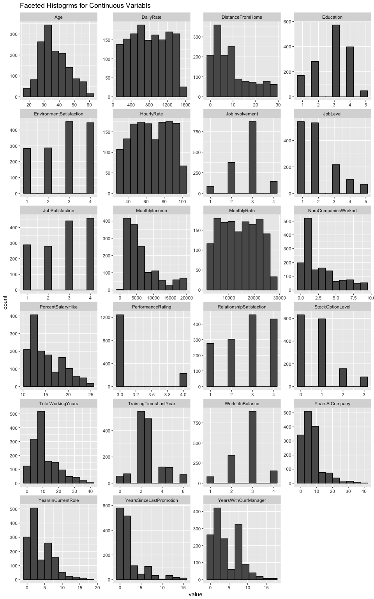

<!--
#```{r setup, include=FALSE}
#knitr::opts_chunk$set(echo = TRUE)
#library(kableExtra) # to make uber sexy tables for output
#library(ggbiplot) # implementation of biplot using ggplot2 for plotting PCs
#library(Amelia) # cool library for exploring missing data
#library(pastecs) # for easy descriptive statistics
#library(ROCR) # for ROC plots and AUC calculations
# turn off scientfic notation for the entire script
#options(scipen = 999)
#```
-->

## Introduction


```r
# load raw data
employeeDatRaw <- read.csv('CaseStudy2data.csv', header=TRUE)
```

<!--

```r
# display missing values map (graphic)
missmap(employeeDatRaw, main="Missing Values in Raw Data")
```

<!-- -->
-->

# Exploratory Data Analysis

```r
# descriptive statistics, load into new data frame for processing
descriptiveTable <- pastecs::stat.desc(employeeDatRaw)

# remove non-numeric features
charCols <- c("Attrition", "BusinessTravel", "Department", "EducationField", "Gender", "JobRole", "MaritalStatus", "Over18", "OverTime")
continuousTable.stats <- descriptiveTable[,!(colnames(descriptiveTable) %in% charCols)]
categoricalTable <- employeeDatRaw[,(colnames(descriptiveTable) %in% charCols)]
continuousTable <- employeeDatRaw[,!(colnames(employeeDatRaw) %in% charCols)]

# remove rows for certain descriptive statistics leaving: N, Mean, Median, Std Dev, Var, Min, Max
remove <- c("CI.mean.0.95", "nbr.val", "nbr.null", "nbr.na", "range", "sum", "SE.mean", "CI.mean", "coef.var")
continuousTable.stats <- continuousTable.stats[-which(rownames(continuousTable.stats) %in% remove),]

# round all numeric values to 2 decimal points
continuousTable.stats <- round(continuousTable.stats, 2)
continuousTable.transposed <- t(continuousTable.stats) # object becomes matrix

# display descriptive statistics
knitr::kable(continuousTable.transposed,caption = "Descriptive Statistics for Numeric Features in the Raw Employee Data", row.names = TRUE, "html") %>%
  kable_styling(bootstrap_options = c("striped","hover", "condensed", "responsive"), full_width = F)
```

<table class="table table-striped table-hover table-condensed table-responsive" style="width: auto !important; margin-left: auto; margin-right: auto;">
<caption>Descriptive Statistics for Numeric Features in the Raw Employee Data</caption>
 <thead>
  <tr>
   <th style="text-align:left;">   </th>
   <th style="text-align:right;"> min </th>
   <th style="text-align:right;"> max </th>
   <th style="text-align:right;"> median </th>
   <th style="text-align:right;"> mean </th>
   <th style="text-align:right;"> var </th>
   <th style="text-align:right;"> std.dev </th>
  </tr>
 </thead>
<tbody>
  <tr>
   <td style="text-align:left;"> Age </td>
   <td style="text-align:right;"> 18 </td>
   <td style="text-align:right;"> 60 </td>
   <td style="text-align:right;"> 36.0 </td>
   <td style="text-align:right;"> 36.92 </td>
   <td style="text-align:right;"> 83.46 </td>
   <td style="text-align:right;"> 9.14 </td>
  </tr>
  <tr>
   <td style="text-align:left;"> DailyRate </td>
   <td style="text-align:right;"> 102 </td>
   <td style="text-align:right;"> 1499 </td>
   <td style="text-align:right;"> 802.0 </td>
   <td style="text-align:right;"> 802.49 </td>
   <td style="text-align:right;"> 162819.59 </td>
   <td style="text-align:right;"> 403.51 </td>
  </tr>
  <tr>
   <td style="text-align:left;"> DistanceFromHome </td>
   <td style="text-align:right;"> 1 </td>
   <td style="text-align:right;"> 29 </td>
   <td style="text-align:right;"> 7.0 </td>
   <td style="text-align:right;"> 9.19 </td>
   <td style="text-align:right;"> 65.72 </td>
   <td style="text-align:right;"> 8.11 </td>
  </tr>
  <tr>
   <td style="text-align:left;"> Education </td>
   <td style="text-align:right;"> 1 </td>
   <td style="text-align:right;"> 5 </td>
   <td style="text-align:right;"> 3.0 </td>
   <td style="text-align:right;"> 2.91 </td>
   <td style="text-align:right;"> 1.05 </td>
   <td style="text-align:right;"> 1.02 </td>
  </tr>
  <tr>
   <td style="text-align:left;"> EmployeeCount </td>
   <td style="text-align:right;"> 1 </td>
   <td style="text-align:right;"> 1 </td>
   <td style="text-align:right;"> 1.0 </td>
   <td style="text-align:right;"> 1.00 </td>
   <td style="text-align:right;"> 0.00 </td>
   <td style="text-align:right;"> 0.00 </td>
  </tr>
  <tr>
   <td style="text-align:left;"> EmployeeNumber </td>
   <td style="text-align:right;"> 1 </td>
   <td style="text-align:right;"> 2068 </td>
   <td style="text-align:right;"> 1020.5 </td>
   <td style="text-align:right;"> 1024.87 </td>
   <td style="text-align:right;"> 362433.30 </td>
   <td style="text-align:right;"> 602.02 </td>
  </tr>
  <tr>
   <td style="text-align:left;"> EnvironmentSatisfaction </td>
   <td style="text-align:right;"> 1 </td>
   <td style="text-align:right;"> 4 </td>
   <td style="text-align:right;"> 3.0 </td>
   <td style="text-align:right;"> 2.72 </td>
   <td style="text-align:right;"> 1.19 </td>
   <td style="text-align:right;"> 1.09 </td>
  </tr>
  <tr>
   <td style="text-align:left;"> HourlyRate </td>
   <td style="text-align:right;"> 30 </td>
   <td style="text-align:right;"> 100 </td>
   <td style="text-align:right;"> 66.0 </td>
   <td style="text-align:right;"> 65.89 </td>
   <td style="text-align:right;"> 413.29 </td>
   <td style="text-align:right;"> 20.33 </td>
  </tr>
  <tr>
   <td style="text-align:left;"> JobInvolvement </td>
   <td style="text-align:right;"> 1 </td>
   <td style="text-align:right;"> 4 </td>
   <td style="text-align:right;"> 3.0 </td>
   <td style="text-align:right;"> 2.73 </td>
   <td style="text-align:right;"> 0.51 </td>
   <td style="text-align:right;"> 0.71 </td>
  </tr>
  <tr>
   <td style="text-align:left;"> JobLevel </td>
   <td style="text-align:right;"> 1 </td>
   <td style="text-align:right;"> 5 </td>
   <td style="text-align:right;"> 2.0 </td>
   <td style="text-align:right;"> 2.06 </td>
   <td style="text-align:right;"> 1.23 </td>
   <td style="text-align:right;"> 1.11 </td>
  </tr>
  <tr>
   <td style="text-align:left;"> JobSatisfaction </td>
   <td style="text-align:right;"> 1 </td>
   <td style="text-align:right;"> 4 </td>
   <td style="text-align:right;"> 3.0 </td>
   <td style="text-align:right;"> 2.73 </td>
   <td style="text-align:right;"> 1.22 </td>
   <td style="text-align:right;"> 1.10 </td>
  </tr>
  <tr>
   <td style="text-align:left;"> MonthlyIncome </td>
   <td style="text-align:right;"> 1009 </td>
   <td style="text-align:right;"> 19999 </td>
   <td style="text-align:right;"> 4919.0 </td>
   <td style="text-align:right;"> 6502.93 </td>
   <td style="text-align:right;"> 22164857.07 </td>
   <td style="text-align:right;"> 4707.96 </td>
  </tr>
  <tr>
   <td style="text-align:left;"> MonthlyRate </td>
   <td style="text-align:right;"> 2094 </td>
   <td style="text-align:right;"> 26999 </td>
   <td style="text-align:right;"> 14235.5 </td>
   <td style="text-align:right;"> 14313.10 </td>
   <td style="text-align:right;"> 50662878.17 </td>
   <td style="text-align:right;"> 7117.79 </td>
  </tr>
  <tr>
   <td style="text-align:left;"> NumCompaniesWorked </td>
   <td style="text-align:right;"> 0 </td>
   <td style="text-align:right;"> 9 </td>
   <td style="text-align:right;"> 2.0 </td>
   <td style="text-align:right;"> 2.69 </td>
   <td style="text-align:right;"> 6.24 </td>
   <td style="text-align:right;"> 2.50 </td>
  </tr>
  <tr>
   <td style="text-align:left;"> PercentSalaryHike </td>
   <td style="text-align:right;"> 11 </td>
   <td style="text-align:right;"> 25 </td>
   <td style="text-align:right;"> 14.0 </td>
   <td style="text-align:right;"> 15.21 </td>
   <td style="text-align:right;"> 13.40 </td>
   <td style="text-align:right;"> 3.66 </td>
  </tr>
  <tr>
   <td style="text-align:left;"> PerformanceRating </td>
   <td style="text-align:right;"> 3 </td>
   <td style="text-align:right;"> 4 </td>
   <td style="text-align:right;"> 3.0 </td>
   <td style="text-align:right;"> 3.15 </td>
   <td style="text-align:right;"> 0.13 </td>
   <td style="text-align:right;"> 0.36 </td>
  </tr>
  <tr>
   <td style="text-align:left;"> RelationshipSatisfaction </td>
   <td style="text-align:right;"> 1 </td>
   <td style="text-align:right;"> 4 </td>
   <td style="text-align:right;"> 3.0 </td>
   <td style="text-align:right;"> 2.71 </td>
   <td style="text-align:right;"> 1.17 </td>
   <td style="text-align:right;"> 1.08 </td>
  </tr>
  <tr>
   <td style="text-align:left;"> StandardHours </td>
   <td style="text-align:right;"> 80 </td>
   <td style="text-align:right;"> 80 </td>
   <td style="text-align:right;"> 80.0 </td>
   <td style="text-align:right;"> 80.00 </td>
   <td style="text-align:right;"> 0.00 </td>
   <td style="text-align:right;"> 0.00 </td>
  </tr>
  <tr>
   <td style="text-align:left;"> StockOptionLevel </td>
   <td style="text-align:right;"> 0 </td>
   <td style="text-align:right;"> 3 </td>
   <td style="text-align:right;"> 1.0 </td>
   <td style="text-align:right;"> 0.79 </td>
   <td style="text-align:right;"> 0.73 </td>
   <td style="text-align:right;"> 0.85 </td>
  </tr>
  <tr>
   <td style="text-align:left;"> TotalWorkingYears </td>
   <td style="text-align:right;"> 0 </td>
   <td style="text-align:right;"> 40 </td>
   <td style="text-align:right;"> 10.0 </td>
   <td style="text-align:right;"> 11.28 </td>
   <td style="text-align:right;"> 60.54 </td>
   <td style="text-align:right;"> 7.78 </td>
  </tr>
  <tr>
   <td style="text-align:left;"> TrainingTimesLastYear </td>
   <td style="text-align:right;"> 0 </td>
   <td style="text-align:right;"> 6 </td>
   <td style="text-align:right;"> 3.0 </td>
   <td style="text-align:right;"> 2.80 </td>
   <td style="text-align:right;"> 1.66 </td>
   <td style="text-align:right;"> 1.29 </td>
  </tr>
  <tr>
   <td style="text-align:left;"> WorkLifeBalance </td>
   <td style="text-align:right;"> 1 </td>
   <td style="text-align:right;"> 4 </td>
   <td style="text-align:right;"> 3.0 </td>
   <td style="text-align:right;"> 2.76 </td>
   <td style="text-align:right;"> 0.50 </td>
   <td style="text-align:right;"> 0.71 </td>
  </tr>
  <tr>
   <td style="text-align:left;"> YearsAtCompany </td>
   <td style="text-align:right;"> 0 </td>
   <td style="text-align:right;"> 40 </td>
   <td style="text-align:right;"> 5.0 </td>
   <td style="text-align:right;"> 7.01 </td>
   <td style="text-align:right;"> 37.53 </td>
   <td style="text-align:right;"> 6.13 </td>
  </tr>
  <tr>
   <td style="text-align:left;"> YearsInCurrentRole </td>
   <td style="text-align:right;"> 0 </td>
   <td style="text-align:right;"> 18 </td>
   <td style="text-align:right;"> 3.0 </td>
   <td style="text-align:right;"> 4.23 </td>
   <td style="text-align:right;"> 13.13 </td>
   <td style="text-align:right;"> 3.62 </td>
  </tr>
  <tr>
   <td style="text-align:left;"> YearsSinceLastPromotion </td>
   <td style="text-align:right;"> 0 </td>
   <td style="text-align:right;"> 15 </td>
   <td style="text-align:right;"> 1.0 </td>
   <td style="text-align:right;"> 2.19 </td>
   <td style="text-align:right;"> 10.38 </td>
   <td style="text-align:right;"> 3.22 </td>
  </tr>
  <tr>
   <td style="text-align:left;"> YearsWithCurrManager </td>
   <td style="text-align:right;"> 0 </td>
   <td style="text-align:right;"> 17 </td>
   <td style="text-align:right;"> 3.0 </td>
   <td style="text-align:right;"> 4.12 </td>
   <td style="text-align:right;"> 12.73 </td>
   <td style="text-align:right;"> 3.57 </td>
  </tr>
</tbody>
</table>

```r
summary(categoricalTable)
```

```
##  Attrition            BusinessTravel                  Department 
##  No :1233   Non-Travel       : 150   Human Resources       : 63  
##  Yes: 237   Travel_Frequently: 277   Research & Development:961  
##             Travel_Rarely    :1043   Sales                 :446  
##                                                                  
##                                                                  
##                                                                  
##                                                                  
##           EducationField    Gender                         JobRole   
##  Human Resources : 27    Female:588   Sales Executive          :326  
##  Life Sciences   :606    Male  :882   Research Scientist       :292  
##  Marketing       :159                 Laboratory Technician    :259  
##  Medical         :464                 Manufacturing Director   :145  
##  Other           : 82                 Healthcare Representative:131  
##  Technical Degree:132                 Manager                  :102  
##                                       (Other)                  :215  
##   MaritalStatus Over18   OverTime  
##  Divorced:327   Y:1470   No :1054  
##  Married :673            Yes: 416  
##  Single  :470                      
##                                    
##                                    
##                                    
## 
```

```r
head(melt(continuousTable))
```

```
## No id variables; using all as measure variables
```

```
##   variable value
## 1      Age    41
## 2      Age    49
## 3      Age    37
## 4      Age    33
## 5      Age    27
## 6      Age    32
```

```r
ggplot(data = melt(continuousTable), mapping = aes(x = value)) + 
  geom_histogram(bins = 10) + facet_wrap(~variable, scales = 'free', ncol = 4) + 
  labs(title="Faceted Histogrms for Continuous Variabls", title_x="", title_y="")
```

```
## No id variables; using all as measure variables
```



<!--
# ```{r, echo=TRUE}
# 
# # descriptive statistics, load into new data frame for processing
# descriptiveTable <- stat.desc(employeeDatRaw)
# 
# # remove non-numeric features
# dropcolumns <- c("Attrition", "BusinessTravel", "Department", "EducationField", "Gender", "JobRole", "MaritalStatus", "Over18", "OverTime")
# descriptiveTable <- descriptiveTable[,!(colnames(descriptiveTable) %in% dropcolumns)]
# 
# # round all numeric values to 2 decimal points
# descriptiveTable <- round(descriptiveTable, 2)
# 
# # remove rows for statistics we don't care about, leaving: N, Mean, Median, Std Dev, Var, Min, Max
# remove <- c("CI.mean.0.95", "nbr.val", "nbr.null", "nbr.na", "range", "sum", "SE.mean", "CI.mean", "coef.var")
# descriptiveTable <- descriptiveTable[-which(rownames(descriptiveTable) %in% remove),]
# 
# # display descriptive statistics
# knitr::kable(descriptiveTable,caption = "Descriptive Statistics for Numeric Features in the Raw Employee Data", row.names = TRUE, "html") %>%
#   kable_styling(bootstrap_options = c("striped","hover", "condensed", "responsive"))
# 
# ```
-->

# Principal Components Analysis


```r
# remove non-numeric features, and features with zero variance
dropcolumnsPCA <- c("Attrition", "BusinessTravel", "Department", "EducationField", "Gender", "JobRole", "MaritalStatus", "Over18", "OverTime", "EmployeeCount", "StandardHours")
employeeDatPCA <- employeeDatRaw[,!(colnames(employeeDatRaw) %in% dropcolumnsPCA)]

# perform PCA
employee_PCA <- prcomp(employeeDatPCA, center=TRUE, scale.=TRUE)

# print principal components (only the first 4 PCs)
print(employee_PCA$rotation[,1:4])
```

```
##                                     PC1          PC2          PC3
## Age                      -0.27701318163  0.282734582 -0.255243670
## DailyRate                 0.00426077363  0.035327273 -0.060184793
## DistanceFromHome         -0.00407312657 -0.056254416 -0.031505557
## Education                -0.07782232390  0.147090254 -0.100854873
## EmployeeNumber            0.00834367344  0.012663301  0.024442569
## EnvironmentSatisfaction  -0.00270192932  0.029119299  0.047612615
## HourlyRate                0.01030174559  0.045123759 -0.030597372
## JobInvolvement            0.00105639109  0.048021678  0.009918806
## JobLevel                 -0.38282854602  0.190741801 -0.140278649
## JobSatisfaction           0.00898835117 -0.036230038 -0.001265818
## MonthlyIncome            -0.37473875831  0.199836691 -0.152409319
## MonthlyRate              -0.00552616924  0.062619432 -0.034457577
## NumCompaniesWorked       -0.04849270998  0.378566110 -0.305267007
## PercentSalaryHike         0.01583477025 -0.425677395 -0.558200473
## PerformanceRating         0.00005998504 -0.444396599 -0.541951943
## RelationshipSatisfaction -0.01567593420  0.087202028  0.007571591
## StockOptionLevel         -0.01583615202 -0.007115231 -0.016558980
## TotalWorkingYears        -0.40345711004  0.169940290 -0.152563127
## TrainingTimesLastYear     0.01153635214 -0.042721117  0.066036475
## WorkLifeBalance          -0.01265443623 -0.013639569  0.023641161
## YearsAtCompany           -0.39150076383 -0.216354019  0.182486142
## YearsInCurrentRole       -0.33592440521 -0.281482097  0.198561913
## YearsSinceLastPromotion  -0.29740803371 -0.203190731  0.162743110
## YearsWithCurrManager     -0.33038017218 -0.281489470  0.214107032
##                                  PC4
## Age                       0.04493031
## DailyRate                 0.05933307
## DistanceFromHome          0.26737682
## Education                 0.31495264
## EmployeeNumber            0.36839697
## EnvironmentSatisfaction  -0.15482630
## HourlyRate                0.45269664
## JobInvolvement            0.28542298
## JobLevel                 -0.12167468
## JobSatisfaction          -0.26066795
## MonthlyIncome            -0.12756215
## MonthlyRate              -0.19929313
## NumCompaniesWorked        0.08178443
## PercentSalaryHike        -0.01047267
## PerformanceRating        -0.01759484
## RelationshipSatisfaction -0.15935858
## StockOptionLevel          0.42525029
## TotalWorkingYears        -0.02777550
## TrainingTimesLastYear    -0.05563666
## WorkLifeBalance          -0.08651447
## YearsAtCompany            0.01816694
## YearsInCurrentRole        0.07489519
## YearsSinceLastPromotion   0.01774554
## YearsWithCurrManager      0.08943220
```

```r
# summary of principal components
summary(employee_PCA)
```

```
## Importance of components:
##                          PC1     PC2     PC3     PC4    PC5     PC6
## Standard deviation     2.158 1.35507 1.32500 1.10059 1.0677 1.03986
## Proportion of Variance 0.194 0.07651 0.07315 0.05047 0.0475 0.04505
## Cumulative Proportion  0.194 0.27051 0.34366 0.39413 0.4416 0.48668
##                            PC7     PC8     PC9    PC10    PC11    PC12
## Standard deviation     1.02803 1.02151 1.01172 0.99544 0.98542 0.97495
## Proportion of Variance 0.04404 0.04348 0.04265 0.04129 0.04046 0.03961
## Cumulative Proportion  0.53072 0.57420 0.61685 0.65814 0.69860 0.73820
##                           PC13    PC14    PC15    PC16   PC17    PC18
## Standard deviation     0.95201 0.95055 0.94246 0.93173 0.8680 0.73578
## Proportion of Variance 0.03776 0.03765 0.03701 0.03617 0.0314 0.02256
## Cumulative Proportion  0.77597 0.81361 0.85062 0.88679 0.9182 0.94075
##                           PC19    PC20    PC21   PC22    PC23    PC24
## Standard deviation     0.72258 0.52903 0.47546 0.4515 0.37649 0.21998
## Proportion of Variance 0.02176 0.01166 0.00942 0.0085 0.00591 0.00202
## Cumulative Proportion  0.96250 0.97416 0.98358 0.9921 0.99798 1.00000
```


```r
# plot PCs using ggbiplot
ggbiplot(employee_PCA, obs.scale=1, var.scale=1, groups=employeeDatPCA$Attrition, ellipse=TRUE, circle=TRUE) + theme(legend.position='top') + scale_color_discrete()
```

<!-- -->

```r
biplot(employee_PCA) # Base R
```

<!-- -->


alright....working some logistic regression..


```r
# copy data set, we can remove features with the dropcolumns as needed to play with the model
# I'm dropping variables with no variation per this 
# https://stackoverflow.com/questions/18171246/error-in-contrasts-when-defining-a-linear-model-in-r
# Solution: There is not enough variation in dependent variable with only one value. So, you need to drop that variable, irrespective of whether that is numeric or character or factor variable.

employee_logistic <- employeeDatRaw
dropcolumns <- c("EmployeeCount", "StandardHours", "Over18")
employee_logistic <- employee_logistic[,!(colnames(employee_logistic) %in% dropcolumns)]

# convert Attrition to 1 and 0 from character based factor
# convert factor levels to numeric
employee_logistic$Attrition <- as.numeric(as.factor(employee_logistic$Attrition))
# change the 2's (No) to 0's
employee_logistic$Attrition[employee_logistic$Attrition == 2] <- 0
# convert back to factor
employee_logistic$Attrition <- as.factor(employee_logistic$Attrition)

# split the raw data into testing and training data
set.seed(100) # set seed so that same sample can be reproduced in future

# now selecting 75% of data as sample from total 'n' rows of the data  
sample <- sample.int(n=nrow(employee_logistic), size=floor(.75*nrow(employee_logistic)), replace=FALSE)

# subset the data using the sample integer vector created above
train <- employee_logistic[sample, ]
test  <- employee_logistic[-sample, ]

# fitting the binomial logistic regression model, Attrition is dependent, fitting using all features
model <- glm(train$Attrition ~., family=binomial(link='logit'),data=train)

summary(model)
```

```
## 
## Call:
## glm(formula = train$Attrition ~ ., family = binomial(link = "logit"), 
##     data = train)
## 
## Deviance Residuals: 
##     Min       1Q   Median       3Q      Max  
## -3.6019   0.0815   0.2399   0.4827   1.6023  
## 
## Coefficients:
##                                       Estimate    Std. Error z value
## (Intercept)                        9.973868952 714.401235710   0.014
## Age                                0.029887138   0.015519890   1.926
## BusinessTravelTravel_Frequently   -2.233641666   0.481270133  -4.641
## BusinessTravelTravel_Rarely       -1.069627300   0.435955264  -2.454
## DailyRate                          0.000347347   0.000257983   1.346
## DepartmentResearch & Development -13.619095265 714.399271461  -0.019
## DepartmentSales                  -13.526347899 714.399414622  -0.019
## DistanceFromHome                  -0.043596680   0.012892239  -3.382
## Education                          0.080182217   0.104374363   0.768
## EducationFieldLife Sciences        0.401810873   0.964007198   0.417
## EducationFieldMarketing            0.097988096   1.018052353   0.096
## EducationFieldMedical              0.567823099   0.961491368   0.591
## EducationFieldOther                0.441982080   1.008820971   0.438
## EducationFieldTechnical Degree    -0.705497171   0.994921722  -0.709
## EmployeeNumber                     0.000061890   0.000181227   0.342
## EnvironmentSatisfaction            0.448987959   0.098551809   4.556
## GenderMale                        -0.544524528   0.217853879  -2.499
## HourlyRate                         0.004621647   0.005145507   0.898
## JobInvolvement                     0.610641818   0.146037675   4.181
## JobLevel                          -0.001243832   0.362172669  -0.003
## JobRoleHuman Resources           -15.491243846 714.399420146  -0.022
## JobRoleLaboratory Technician      -1.700637776   0.584530704  -2.909
## JobRoleManager                    -1.317921493   0.989460613  -1.332
## JobRoleManufacturing Director     -0.593091072   0.652300068  -0.909
## JobRoleResearch Director           0.169599755   1.144037243   0.148
## JobRoleResearch Scientist         -0.945403387   0.596291046  -1.585
## JobRoleSales Executive            -1.421270445   1.197043218  -1.187
## JobRoleSales Representative       -2.467668778   1.266383941  -1.949
## JobSatisfaction                    0.466783441   0.097089203   4.808
## MaritalStatusMarried              -0.252693047   0.303229349  -0.833
## MaritalStatusSingle               -1.354066656   0.394512835  -3.432
## MonthlyIncome                      0.000006062   0.000095978   0.063
## MonthlyRate                       -0.000001552   0.000014698  -0.106
## NumCompaniesWorked                -0.219105667   0.046484670  -4.714
## OverTimeYes                       -2.030924416   0.227930864  -8.910
## PercentSalaryHike                  0.013648762   0.045749471   0.298
## PerformanceRating                  0.137244988   0.466088657   0.294
## RelationshipSatisfaction           0.264882917   0.096440720   2.747
## StockOptionLevel                   0.144379606   0.185060377   0.780
## TotalWorkingYears                  0.095598213   0.034951620   2.735
## TrainingTimesLastYear              0.163774458   0.084505830   1.938
## WorkLifeBalance                    0.558835519   0.145596260   3.838
## YearsAtCompany                    -0.102035993   0.046028439  -2.217
## YearsInCurrentRole                 0.155782549   0.054462595   2.860
## YearsSinceLastPromotion           -0.172573074   0.049252282  -3.504
## YearsWithCurrManager               0.120472866   0.055272774   2.180
##                                              Pr(>|z|)    
## (Intercept)                                  0.988861    
## Age                                          0.054138 .  
## BusinessTravelTravel_Frequently            0.00000346 ***
## BusinessTravelTravel_Rarely                  0.014146 *  
## DailyRate                                    0.178175    
## DepartmentResearch & Development             0.984790    
## DepartmentSales                              0.984894    
## DistanceFromHome                             0.000721 ***
## Education                                    0.442358    
## EducationFieldLife Sciences                  0.676815    
## EducationFieldMarketing                      0.923322    
## EducationFieldMedical                        0.554812    
## EducationFieldOther                          0.661301    
## EducationFieldTechnical Degree               0.478264    
## EmployeeNumber                               0.732724    
## EnvironmentSatisfaction                    0.00000522 ***
## GenderMale                                   0.012437 *  
## HourlyRate                                   0.369084    
## JobInvolvement                             0.00002897 ***
## JobLevel                                     0.997260    
## JobRoleHuman Resources                       0.982700    
## JobRoleLaboratory Technician                 0.003621 ** 
## JobRoleManager                               0.182873    
## JobRoleManufacturing Director                0.363229    
## JobRoleResearch Director                     0.882148    
## JobRoleResearch Scientist                    0.112859    
## JobRoleSales Executive                       0.235102    
## JobRoleSales Representative                  0.051344 .  
## JobSatisfaction                            0.00000153 ***
## MaritalStatusMarried                         0.404653    
## MaritalStatusSingle                          0.000599 ***
## MonthlyIncome                                0.949639    
## MonthlyRate                                  0.915918    
## NumCompaniesWorked                         0.00000243 ***
## OverTimeYes                      < 0.0000000000000002 ***
## PercentSalaryHike                            0.765446    
## PerformanceRating                            0.768406    
## RelationshipSatisfaction                     0.006022 ** 
## StockOptionLevel                             0.435287    
## TotalWorkingYears                            0.006235 ** 
## TrainingTimesLastYear                        0.052620 .  
## WorkLifeBalance                              0.000124 ***
## YearsAtCompany                               0.026637 *  
## YearsInCurrentRole                           0.004232 ** 
## YearsSinceLastPromotion                      0.000459 ***
## YearsWithCurrManager                         0.029287 *  
## ---
## Signif. codes:  0 '***' 0.001 '**' 0.01 '*' 0.05 '.' 0.1 ' ' 1
## 
## (Dispersion parameter for binomial family taken to be 1)
## 
##     Null deviance: 1000.51  on 1101  degrees of freedom
## Residual deviance:  636.51  on 1056  degrees of freedom
## AIC: 728.51
## 
## Number of Fisher Scoring iterations: 15
```

```r
# predict based on the test data, type='response' output probabilities in the form of P(y=1|X)
fittedresults <- predict(model, newdata=test, type='response')

# count any NAs in the fittedresults
sum(is.na(fittedresults))
```

```
## [1] 0
```

```r
# if P(y=1|X) > 0.5 then y = 1 otherwise y=0
fittedresults <- ifelse(fittedresults > 0.5, 1, 0)

# calculate the mean of the fitted results that don't equal the observed result - IGNORE NAs
misClasificError <- mean(fittedresults != test$Attrition, na.rm=TRUE) # this adds up all the instances of misclassification then divides by total (via mean)

# print the output as 100% - error
print(paste('Accuracy',1-misClasificError))
```

```
## [1] "Accuracy 0.880434782608696"
```

and now some ROC curves...


```r
pr <- prediction(fittedresults, test$Attrition)
prf <- performance(pr, measure = "tpr", x.measure = "fpr")
plot(prf)
```

<!-- -->

```r
auc <- performance(pr, measure = "auc")
auc <- auc@y.values[[1]]
auc
```

```
## [1] 0.7002536
```
